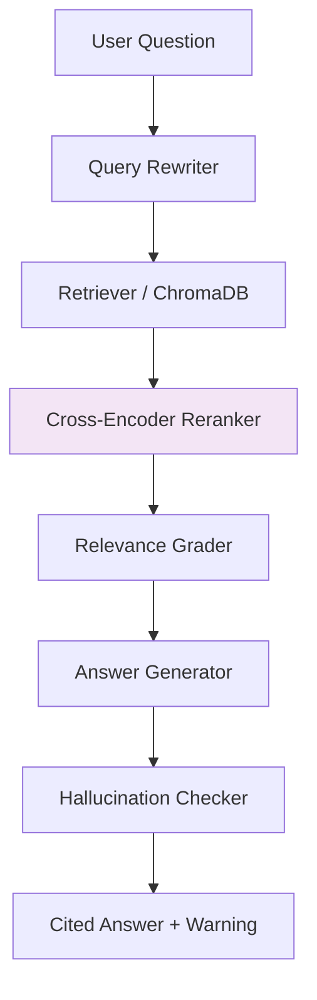

# Project Summary: Agentic RAG Research Assistant

## 1. High-Level Overview
The **Agentic RAG Research Assistant** is a production-grade web application that enables users to upload documents (PDF, DOCX, TXT, MD) and ask natural-language questions about their contents. Instead of relying on a basic "chat with PDF" script, this project implements an advanced **multi-agent pipeline** built with LangGraph. The multi-agent setup guarantees high-quality, hallucination-free answers by explicitly routing the question through query rewriting, chunk retrieval, cross-encoder re-ranking, relevance grading, and hallucination checking before answering the user. Every generated response is grounded with inline citations linking back to exact document pages.

**Key differentiators from a basic RAG demo:**
- 5-agent LangGraph state machine with per-node latency tracking
- Cross-encoder re-ranking for improved retrieval precision
- LLM-based hallucination detection with structured output parsing
- Structured JSON logging with X-Request-ID tracing
- Rate limiting, input sanitization, and prompt-injection detection
- In-memory caching layer for LLM responses and embeddings
- RAGAS evaluation framework comparing agentic vs. naive RAG
- CI/CD pipeline with linting, type-checking, tests, and Docker builds
- Server-Sent Events (SSE) streaming endpoint for real-time UI updates

## 2. System Architecture
The application is split into a frontend, backend, and a multi-agent orchestration layer, operating under a Retrieval-Augmented Generation (RAG) paradigm.

### The Multi-Agent Pipeline (LangGraph State Machine)
1. **Query Rewriter**: Reformulates conversational follow-up questions into standalone queries by utilizing chat history (resolves pronouns and context).
2. **Retrieval Agent**: Searches the vector store (ChromaDB) for the top-k chunks matching the standalone query's semantic meaning, then re-ranks them with a cross-encoder (`ms-marco-MiniLM-L-6-v2`) for improved precision.
3. **Relevance Grader**: Uses an LLM to assign binary relevance scores to retrieved chunks, filtering out noisy/irrelevant chunks before text generation to minimize hallucinations.
4. **Answer Generator**: Synthesizes the filtered chunks and user query to produce a grounded response complete with inline citations (`[1]`, `[2]`).
5. **Hallucination Checker**: Cross-verifies the generated answer's claims against the source context to explicitly flag unsupported assertions.

### Ingestion Pipeline
When documents are uploaded, the ingestion module extracts text, chunks it (500 tokens with 50-token overlap), embeds the text utilizing models like `all-MiniLM-L6-v2`, and stores the embeddings and metadata in ChromaDB.

## 3. Tech Stack Breakdown
| Layer | Technology | Rationale |
|-------|-----------|-----------|
| **Language** | Python 3.11+ | Modern async, type hints, performance |
| **Backend** | FastAPI + Uvicorn | Auto OpenAPI docs, async, Pydantic validation |
| **Agent Orchestration** | LangGraph | Explicit state machine, debuggable, composable |
| **Vector Store** | ChromaDB (local) | Zero cost, no external deps, sufficient for RAG scale |
| **Embeddings** | `all-MiniLM-L6-v2` (HuggingFace) | Free, local, strong semantic quality |
| **LLM** | Google Gemini (default) / OpenAI | Free tier available, fast, cost-effective |
| **Re-ranking** | `ms-marco-MiniLM-L-6-v2` (Cross-Encoder) | Free, local, improves retrieval precision |
| **Doc Parsing** | pdfplumber, python-docx | Reliable extraction with page tracking |
| **Frontend** | Streamlit | Rapid UI dev, native chat components |
| **Evaluation** | RAGAS | Industry-standard RAG metrics |
| **Observability** | LangSmith + structlog + custom metrics | Full agent tracing + structured JSON logging |
| **Security** | Input validation, rate limiting, prompt-injection detection | Defense-in-depth for production readiness |
| **Caching** | In-memory TTL cache | Reduces LLM costs and latency |
| **Containerization** | Docker + Compose | Reproducible deployment |
| **CI/CD** | GitHub Actions | Lint, type-check, test, build, deploy |

## 4. Key User Flows
- **Single Document Q&A**: User uploads a document. After background processing (ingestion, chunking, embedding), the user chats with the bot and receives answers with expandable citation cards showing exact source chunks.
- **Multi-Document Session**: Users can upload additional documents mid-session, and optionally scope queries to a specific document utilizing dropdown filters.
- **Streaming Responses**: The `/ask/stream` endpoint provides Server-Sent Events (SSE) for real-time agent pipeline progress updates.
- **Error Handling**: 
  - If no relevant information is found by the Relevance Grader, the bot honestly responds rather than fabricating an answer.
  - Corrupt or unsupported files fail gracefully with friendly UI toasts.
  - Prompt injection attempts are detected and logged (but not blocked, since the grounded generation prompt is robust).

## 5. Production-Ready Features
- **Structured Logging**: JSON-formatted logs with request IDs for distributed tracing
- **Rate Limiting**: Token-bucket algorithm per client IP (configurable)
- **Input Sanitization**: HTML escaping, control character stripping, length limits
- **Prompt Injection Detection**: Heuristic pattern matching against known injection vectors
- **Metrics Collection**: Counters, histograms, and gauges for agent execution, latency, and errors
- **Caching**: TTL-based in-memory cache for LLM responses (1h) and embeddings (24h)
- **Health Checks**: `/health` endpoint with Docker healthcheck integration
- **CI/CD**: GitHub Actions pipeline with linting, type-checking, unit tests, integration tests, and Docker builds

## 6. Development & Deployment
The system is designed to be easily configurable and highly observable via LangSmith tracing and structured logging. For local development, FastAPI serves the endpoints (`/upload`, `/ask`, `/ask/stream`, `/health`, `/metrics`), and Streamlit communicates with it via REST. The whole setup is containerized using Docker and Docker Compose for a reproducible environment. Deployment targets include HuggingFace Spaces or container orchestration services.

## 7. Resume-Ready Highlights
- **Built a production-grade multi-agent RAG pipeline** with 5 specialized LangGraph agents (Query Rewriter, Retriever, Relevance Grader, Answer Generator, Hallucination Checker) achieving improved answer quality over naive RAG
- **Implemented cross-encoder re-ranking** using `ms-marco-MiniLM-L-6-v2` to improve retrieval precision beyond bi-encoder similarity alone
- **Added LLM-based hallucination detection** that cross-verifies generated answers against source contexts, flagging unsupported claims
- **Designed for observability** with structured JSON logging (structlog), X-Request-ID tracing, LangSmith integration, and custom metrics collection (counters, histograms, gauges)
- **Applied defense-in-depth security**: input sanitization, rate limiting, prompt-injection detection, path-traversal prevention, and HTML escaping
- **Built CI/CD pipeline** (GitHub Actions) with linting (Ruff), type-checking (MyPy), unit tests, integration tests, regression tests against a golden dataset, and Docker image builds
- **Implemented RAGAS evaluation framework** comparing agentic vs. naive RAG on faithfulness, answer relevancy, context precision, and context recall
- **Added Server-Sent Events streaming** endpoint for real-time agent pipeline progress updates
- **Containerized** with Docker Compose for reproducible local development and deployment
