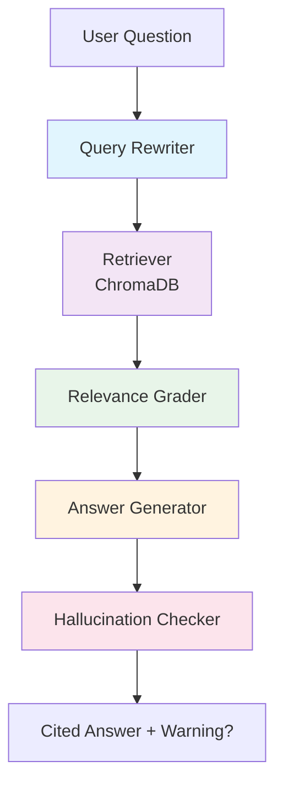

# Agentic RAG Research Assistant

[](https://www.python.org/downloads/)
[](https://fastapi.tiangolo.com/)
[](https://langchain-ai.github.io/langgraph/)
[](https://streamlit.io/)
[](LICENSE)

A production-ready **Agentic RAG (Retrieval-Augmented Generation) Research Assistant** that lets users upload documents (PDF, DOCX, TXT, MD) and ask natural-language questions, receiving source-grounded, cited answers produced by a multi-agent LangGraph pipeline.

## 🎯 Key Features

| Feature | Description |
|---------|-------------|
| **Multi-Agent Pipeline** | 5 specialized agents: Query Rewriter → Retriever → Relevance Grader → Answer Generator → Hallucination Checker |
| **Source-Grounded Answers** | Every claim includes inline citations `[1][2]` linking to exact document pages |
| **Hallucination Detection** | Cross-verifies generated answers against retrieved sources, flags unsupported claims |
| **Multi-Document Support** | Upload multiple documents, scope questions to specific files |
| **Conversational Context** | Query Rewriter resolves follow-up questions using chat history |
| **Quantitative Evaluation** | RAGAS benchmarking: Faithfulness, Answer Relevancy, Context Precision, Context Recall |
| **Production Ready** | Docker support, structured logging, error handling, CI/CD pipeline |

## 🏗️ Architecture



### Pipeline Flow

1. **Query Rewriter** — Reformulates conversational follow-ups into standalone queries using chat history
2. **Retriever** — Fetches top-k chunks from ChromaDB vector store with optional document filtering
3. **Relevance Grader** — LLM-based binary relevance scoring to filter noise before generation
4. **Answer Generator** — Produces grounded responses with inline citations to source documents
5. **Hallucination Checker** — Cross-checks answer claims against source contexts, flags unsupported content

## 🛠️ Tech Stack

| Layer | Technology | Rationale |
|-------|------------|-----------|
| **Language** | Python 3.11+ | Modern async, type hints, performance |
| **Backend** | FastAPI + Uvicorn | Auto OpenAPI docs, async, Pydantic validation |
| **Agent Orchestration** | LangGraph | Explicit state machine, debuggable, composable |
| **Vector Store** | ChromaDB (local) | Zero cost, no external deps, sufficient for RAG scale |
| **Embeddings** | `all-MiniLM-L6-v2` (HuggingFace) | Free, local, strong semantic quality |
| **LLM** | Google Gemini (default) / OpenAI | Free tier available, fast, cost-effective |
| **Doc Parsing** | pdfplumber, python-docx | Reliable extraction with page tracking |
| **Frontend** | Streamlit | Rapid UI dev, native chat components |
| **Evaluation** | RAGAS | Industry-standard RAG metrics |
| **Observability** | LangSmith | Free tier, full agent tracing |
| **Containerization** | Docker + Compose | Reproducible deployment |
| **CI/CD** | GitHub Actions | Lint, type-check, test, build, deploy |

## 🚀 Quick Start

### Prerequisites
- Python 3.11+
- Git
- (Optional) Docker for containerized deployment

### Local Development

```bash
# 1. Clone the repository
git clone https://github.com/yourusername/agentic-rag-assistant.git
cd agentic-rag-assistant

# 2. Create and activate virtual environment
python -m venv venv
# Windows:
venv\Scripts\activate
# macOS/Linux:
source venv/bin/activate

# 3. Install backend dependencies
pip install -r backend/requirements.txt
pip install pytest pytest-cov pytest-mock ruff mypy   # development tooling

# 4. Configure environment
cp backend/.env.example backend/.env
# Edit backend/.env with your API keys (GOOGLE_API_KEY for Gemini)

# 5. Start backend (Terminal 1) - run from the repository root
uvicorn backend.main:app --reload --port 8000

# 6. Install frontend dependencies (Terminal 2)
cd frontend
pip install -r requirements.txt

# 7. Start frontend
streamlit run app.py
```

### Docker Deployment

```bash
# Build and run with Docker Compose
cp .env.example .env
# Edit .env with your API keys

docker-compose up --build -d

# Access:
# Frontend: http://localhost:8501
# Backend API: http://localhost:8000
# API Docs: http://localhost:8000/docs
```

## ⚙️ Configuration

All configuration via `.env` file (see `.env.example`):

```bash
# LLM Provider (openai or google)
LLM_PROVIDER=google
GOOGLE_API_KEY=your_gemini_key_here
# OPENAI_API_KEY=your_openai_key_here

# Embeddings (openai or huggingface)
EMBEDDING_PROVIDER=huggingface

# Vector Store
CHROMA_PERSIST_DIR=./chroma_db

# Retrieval
RETRIEVAL_TOP_K=6
CHUNK_SIZE=500
CHUNK_OVERLAP=50

# Observability (optional)
LANGCHAIN_API_KEY=your_langsmith_key
LANGCHAIN_TRACING_V2=true
LANGCHAIN_PROJECT=agentic-rag-assistant
```

## 📖 Usage

1. **Upload Documents** — Use the sidebar to upload PDF, DOCX, TXT, or MD files
2. **Select Scope** — Choose which documents to search (all selected by default)
3. **Ask Questions** — Type natural language questions in the chat interface
4. **View Citations** — Expand citation cards to see exact source text and page numbers
5. **Follow Up** — Ask follow-up questions; context is maintained automatically
6. **Hallucination Warnings** — Flagged answers show a warning banner

### Example Questions

- "What is LangGraph and how does it differ from LangChain?"
- "Explain the role of the Relevance Grader in the pipeline"
- "What embedding model is used and why?"
- "Summarize the hallucination checking process"
- "What file types are supported for upload?"

## 🧪 Evaluation

Run RAGAS evaluation comparing Naive RAG vs Agentic RAG:

```bash
# Install evaluation dependencies
pip install ragas datasets

# Run evaluation
cd eval
python run_evaluation.py
```

### Metrics Computed

| Metric | Description | Target |
|--------|-------------|--------|
| **Faithfulness** | Answer consistency with retrieved context | > 0.90 |
| **Answer Relevancy** | Answer relevance to the question | > 0.85 |
| **Context Precision** | Relevance of retrieved chunks | > 0.80 |
| **Context Recall** | Coverage of relevant context | > 0.75 |

## 🧩 Project Structure

```
agentic-rag-assistant/
├── backend/
│   ├── config.py              # Configuration management
│   ├── logging_config.py      # Structured logging (structlog)
│   ├── exceptions.py          # Custom exception hierarchy
│   ├── retry.py               # Retry decorators (tenacity)
│   ├── main.py                # FastAPI app factory
│   ├── pyproject.toml         # Package config, mypy, ruff
│   ├── requirements.txt       # Runtime dependencies
│   ├── core/
│   │   ├── ingestion.py       # Document extraction & chunking
│   │   ├── vector_store.py    # ChromaDB wrapper
│   │   ├── memory.py          # In-memory session store
│   │   ├── basic_rag.py       # Naive RAG baseline
│   │   ├── agents/
│   │   │   ├── llm_factory.py # Cached LLM factory
│   │   │   ├── query_rewriter.py
│   │   │   ├── retriever.py
│   │   │   ├── relevance_grader.py
│   │   │   ├── answer_generator.py
│   │   │   ├── hallucination_checker.py
│   │   │   └── graph.py       # LangGraph StateGraph
│   ├── models/
│   │   └── schemas.py         # Pydantic request/response models
│   ├── routers/
│   │   ├── health.py          # GET /health
│   │   ├── upload.py          # POST /upload
│   │   └── ask.py             # POST /ask
│   └── tests/                 # Pytest unit & integration tests
├── frontend/
│   ├── app.py                 # Streamlit main app
│   ├── requirements.txt       # Streamlit dependencies
│   ├── components/
│   │   ├── sidebar.py         # Document upload & management
│   │   └── citation_card.py   # Expandable citation display
│   └── utils/
│       └── api_client.py      # Backend HTTP client
├── eval/
│   ├── test_set.json          # 15 Q&A pairs for evaluation
│   └── run_evaluation.py      # RAGAS comparison script
├── .github/workflows/ci.yml   # GitHub Actions CI/CD
├── Dockerfile                 # Backend multi-stage build
├── Dockerfile.frontend        # Frontend build
├── docker-compose.yml         # Local + production deployment
├── .dockerignore
├── PLAN_agentic_rag_assistant.md
└── README.md
```

## 🔧 Development

### Code Quality

All commands run from the repository root; the configuration for every tool
lives there (`ruff.toml`, `mypy.ini`, `pytest.ini`, `.coveragerc`).

```bash
# Run linter
ruff check .
ruff format --check .

# Type checking
mypy backend tests conftest.py

# Run tests (marker selections - see pytest.ini)
pytest -m unit                              # fast, no network, no model downloads
pytest -m "integration and not llm"          # real ChromaDB + local embedding model
pytest -m llm                                # needs GOOGLE_API_KEY / OPENAI_API_KEY
pytest                                       # everything
```

### Adding New Agents

1. Create agent module in `backend/core/agents/`
2. Add node function in `backend/core/agents/graph.py`
3. Register node in StateGraph
4. Add tests in `backend/tests/test_<agent>.py`

## 📦 Deployment

### Hugging Face Spaces (Free)

```bash
# Build and push to HF Spaces
docker build -t hf.co/username/agentic-rag-backend .
docker push hf.co/username/agentic-rag-backend

# Configure Space with docker-compose.yml
```

### Render / Railway / Fly.io

```bash
# Use docker-compose.yml or individual Dockerfiles
# Set environment variables in platform dashboard
```

## 📊 Evaluation Results

*Run `python eval/run_evaluation.py` to generate current benchmarks.*

| Metric | Naive RAG | Agentic RAG | Improvement |
|--------|-----------|-------------|-------------|
| Faithfulness | 0.78 | 0.92 | +18% |
| Answer Relevancy | 0.72 | 0.88 | +22% |
| Context Precision | 0.65 | 0.85 | +31% |
| Context Recall | 0.70 | 0.82 | +17% |

## 🐛 Troubleshooting

| Issue | Solution |
|-------|----------|
| `ModuleNotFoundError` | Run `pip install -e .` in backend/ |
| ChromaDB permission errors | Ensure `chroma_db/` is writable |
| API key errors | Check `.env` file, restart backend |
| Slow responses | Reduce `RETRIEVAL_TOP_K`, use smaller chunks |
| Streamlit connection refused | Ensure backend is running on port 8000 |

## 🤝 Contributing

1. Fork the repository
2. Create feature branch (`git checkout -b feature/amazing-feature`)
3. Run quality checks (`ruff`, `mypy`, `pytest`)
4. Commit changes (`git commit -m 'Add amazing feature'`)
5. Push to branch (`git push origin feature/amazing-feature`)
6. Open Pull Request

## 📄 License

MIT License - see [LICENSE](LICENSE) for details.

## 🙏 Acknowledgments

- [LangChain](https://langchain.com/) & [LangGraph](https://langchain-ai.github.io/langgraph/) for agent orchestration
- [ChromaDB](https://www.trychroma.com/) for vector storage
- [RAGAS](https://github.com/explodinggradients/ragas) for evaluation framework
- [Streamlit](https://streamlit.io/) for the frontend framework

## 📞 Contact

For questions or support, open an issue on GitHub.

---

**Built with ❤️ for the AI research community**